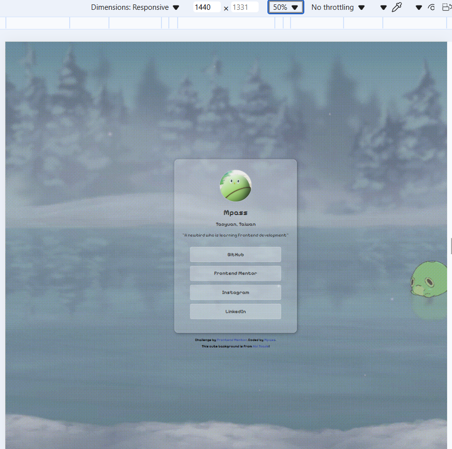
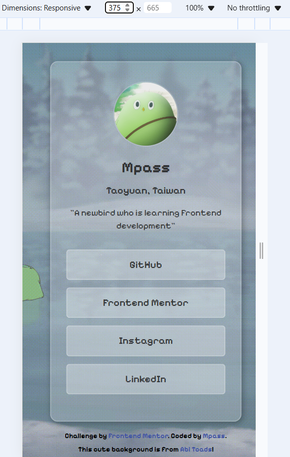

# Frontend Mentor - Social links profile solution

This is a solution to the [Social links profile challenge on Frontend Mentor](https://www.frontendmentor.io/challenges/social-links-profile-UG32l9m6dQ). Frontend Mentor challenges help you improve your coding skills by building realistic projects. 

## Table of contents

- [Overview](#overview)
  - [Screenshot](#screenshot)
  - [Links](#links)
- [My process](#my-process)
  - [Built with](#built-with)
  - [What I learned](#what-i-learned)
  - [Continued development](#continued-development)
  - [Useful resources](#useful-resources)
- [Author](#author)

**Note: Delete this note and update the table of contents based on what sections you keep.**

## Overview

### Screenshot

### Links

- Solution URL: [https://github.com/Benson0721/My-simple-profile]
- Live Site URL: [https://benson0721.github.io/My-simple-profile/]

## My process
### Built with

- Semantic HTML5 markup
- CSS custom properties
- Flexbox
- Mobile-first workflow
- Scss

### What I learned
  Learn how to create visual effect like cloudy glass to make my profile more suitable with my background.

### Continued development
I will continue to put in effort to create works that are more personal, rather than just resembling design files.
### Useful resources

- [https://steamcommunity.com/profiles/76561198314933366/myworkshopfiles/?section=items&appid=431960]- This artist create so many cute wallpapers that can heal people's hearts.

## Author

- Website - [https://github.com/Benson0721]
- Frontend Mentor - [https://www.frontendmentor.io/profile/Benson0721]
